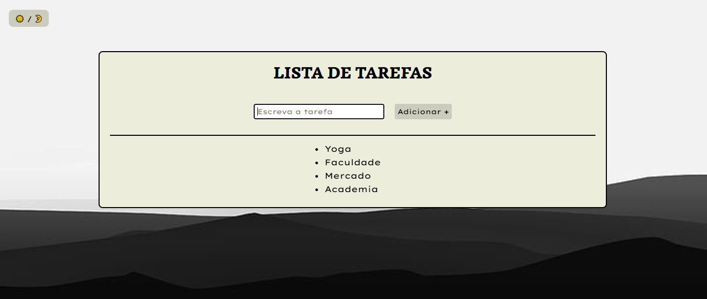

# ✅ PROJETO: Lista de Tarefas Responsiva com Modo Escuro

Este projeto é uma aplicação simples e funcional de **Lista de Tarefas**, desenvolvida com **HTML, CSS, JavaScript e jQuery**. Ele inclui recursos como:

- 🎨 Modo Claro/Escuro
- 📱 Layout responsivo
- 🧾 Criação de tarefas
- ✅ Marcar como concluída (clique simples)
- ❌ Remoção de tarefa (clique duplo)
- 🌄 Imagem de fundo dinâmica e adaptativa

---

## 📸 Demonstração

